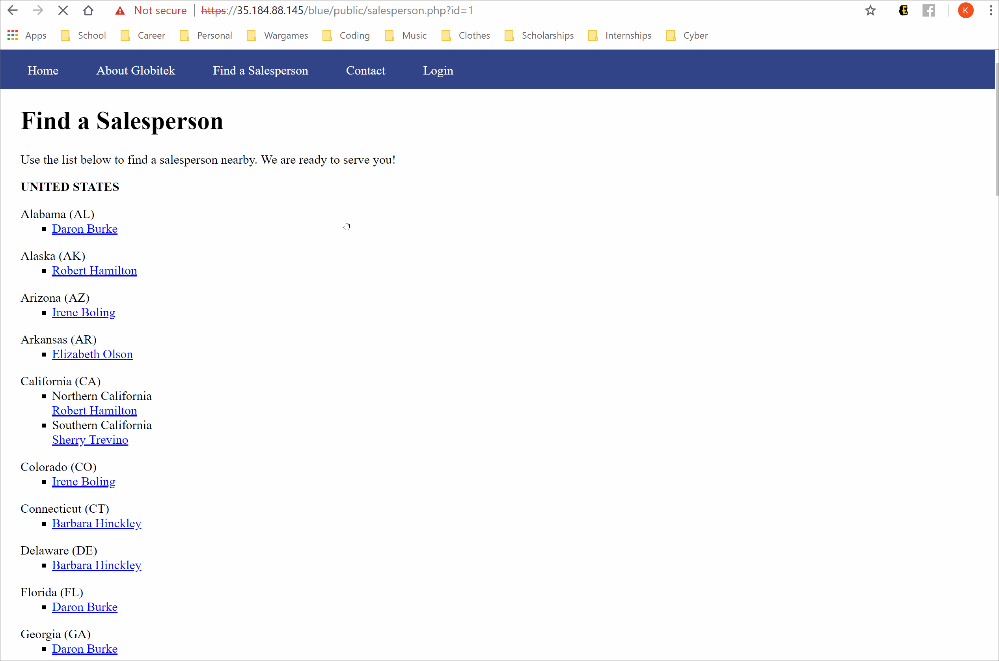
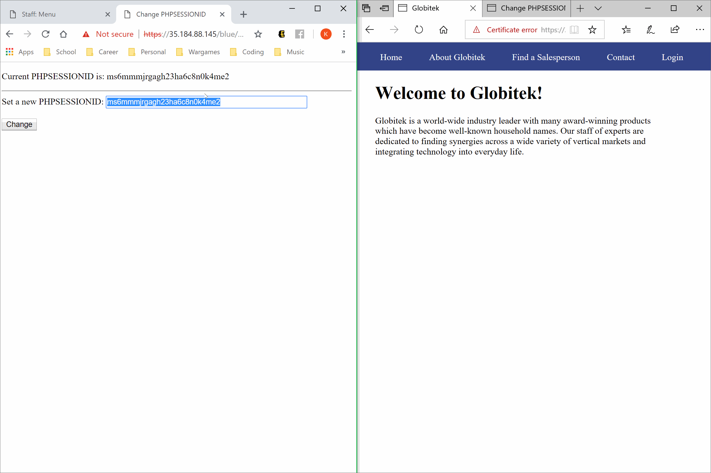
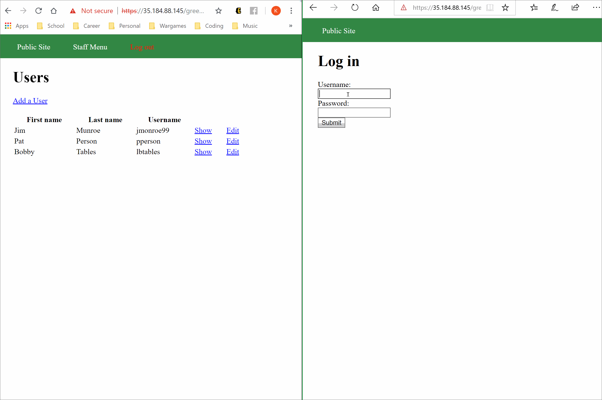
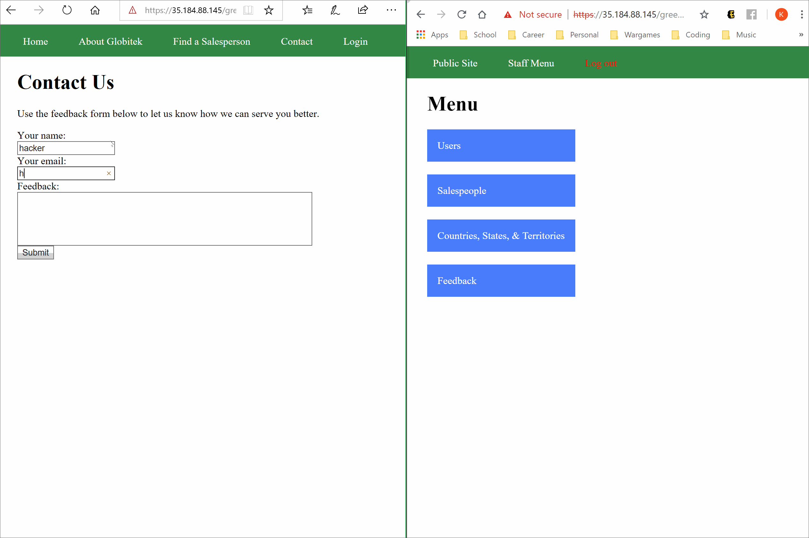
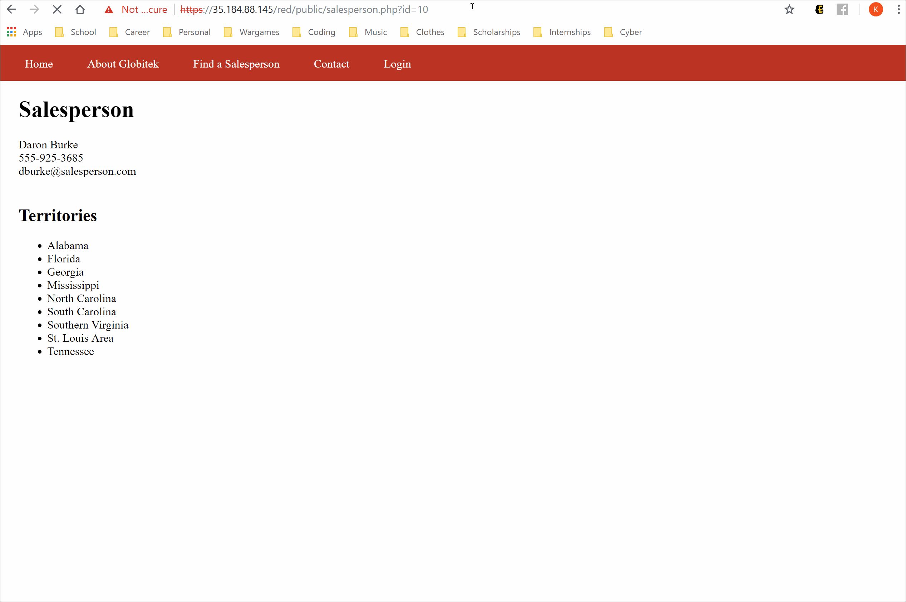
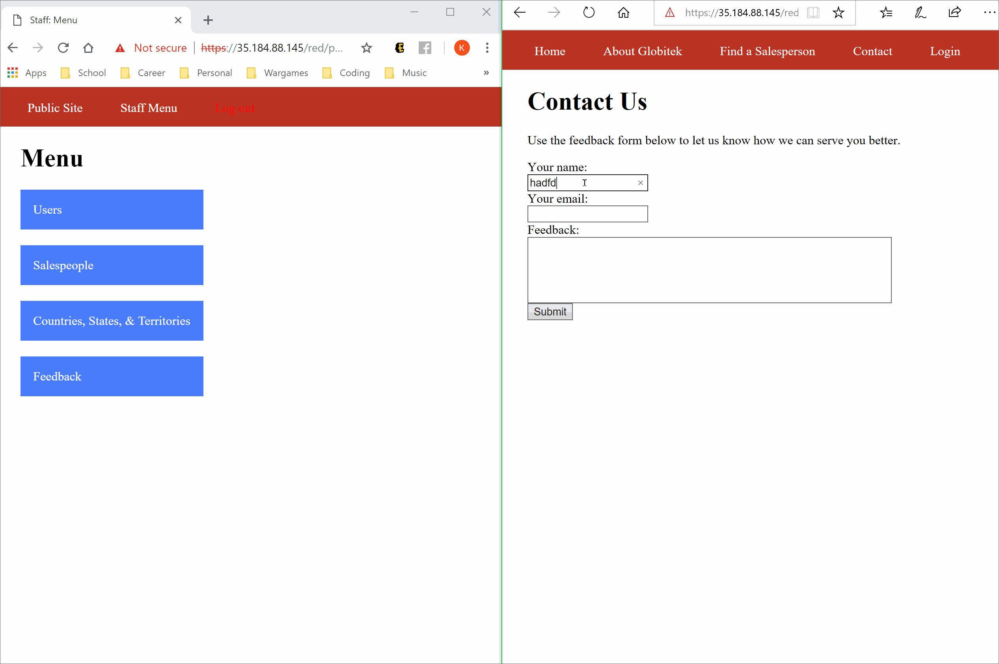

# codepath-cyber-week8

# Project 8 - Pentesting Live Targets

Time spent: **3** hours spent in total

> Objective: Identify vulnerabilities in three different versions of the Globitek website: blue, green, and red.

The six possible exploits are:
* Username Enumeration
* Insecure Direct Object Reference (IDOR)
* SQL Injection (SQLi)
* Cross-Site Scripting (XSS)
* Cross-Site Request Forgery (CSRF)
* Session Hijacking/Fixation

Each version of the site has been given two of the six vulnerabilities. (In other words, all six of the exploits should be assignable to one of the sites.)

## Blue

Vulnerability #1: SQL Injection (SQLi)

We performed a SQL Injection at the '/blue/public/salesperson.php?id=?' endpoint by replacing the parameter for 'id=?' with ' OR SLEEP(5)=0--' which caused the page to pause for 5 seconds, indicating a successful injection.

Vulnerability #2: Session Hijacking/Fixation

In this exploit we used two different browsers to manipulate the session IDS. We took the PHPSESSIONID token of a user that was already logged in and set the different instance to the same token. The user could then bypass the login form and directly access the account that the session token belonged to.

## Green

Vulnerability #1: Username Enumeration

By attempting to log in (unsuccesfully), the site reveals some info. If the username exists but the password was incorrect, the message "Log in was unsuccessful" will be in bold. If the username does not exist, then the error message will be unbolded.

Vulnerability #2: Cross-Site Scripting (XSS)

In the Feedback Form, the user can insert Javascript code into the Feedback section so when the admin checks the form, the script will execute.

## Red

Vulnerability #1: Insecure Direct Object Reference (IDOR)

In this exploit, we could manipulate the URL to link us directly to pages that were not intended for public view. We could do this by changing the 'id=??' parameter to access certain pages.

Vulnerability #2: Cross-Site Request Forgery (CSRF)

In this exploit, we create an .htm file and submit it using the Feedback Form. Then when an admin follows the link, it will execute a script to change and access the page of a Salesperson.

<!DOCTYPE html>
		<html>
	<head>
		<title>Your Feedback</title>
		
	</head>
	<body>

		
 you should secure your site

		
		<form action="https://35.184.88.145/red/public/staff/salespeople/edit.php?id=1" method="POST" class="hide-form" id="attackform"  name="form">
			<input type="text" name="first_name" value="Dummy" /> 
			<input type="text" name="last_name" value="Burke" /> 
			<input type="text" name="phone" value="888-888-8888" /> 
			<input type="text" name="email" value="free_email@pmail.com" /> 
		</form>
		
</html>

## Notes

No major problems encountered, just being aware to use multiple browsers for some exploits to mimic attackers and admins. Fun challenges!
